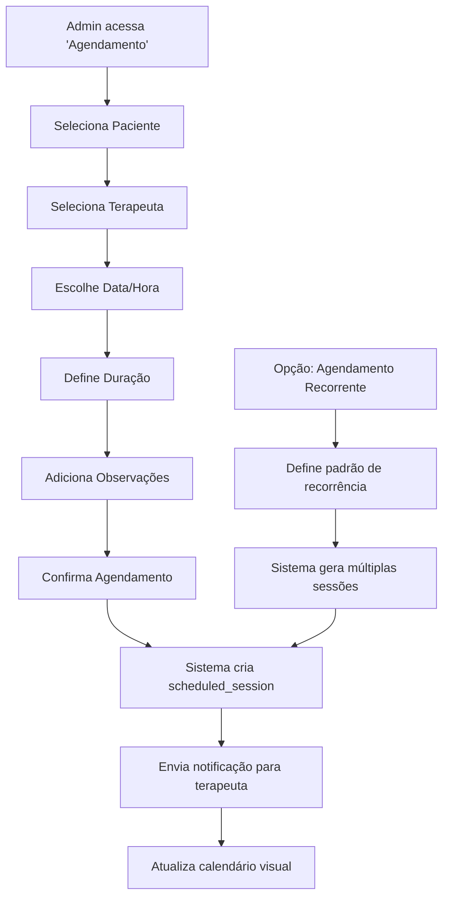
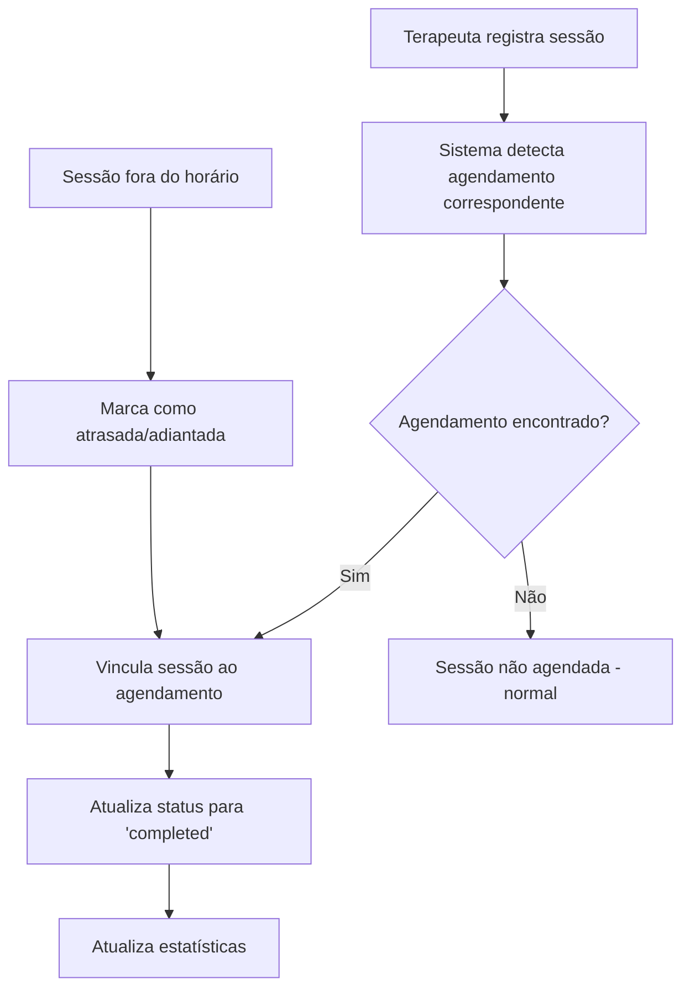
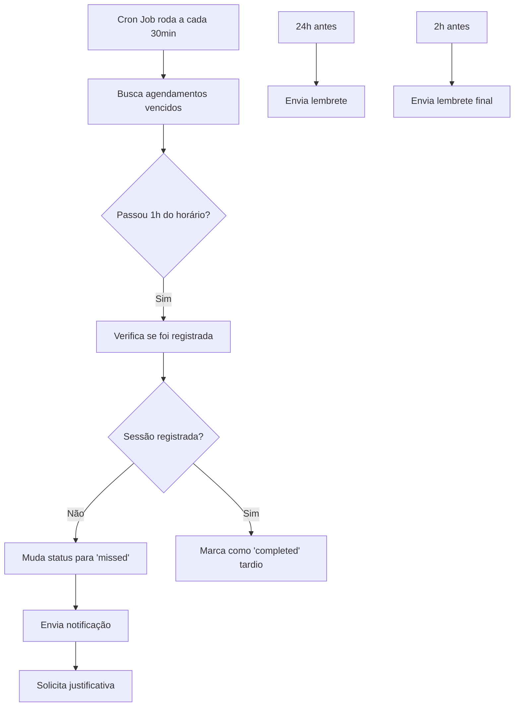

# 📅 SISTEMA DE AGENDAMENTO ABAPLAY - ESPECIFICAÇÃO COMPLETA

## 📋 **RESUMO EXECUTIVO**

Este documento detalha a implementação completa do Sistema de Agendamento para o ABAplay, incluindo todas as fases (MVP, Melhorias e Avançado). O sistema permite agendamento de sessões, monitoramento de comparecimento, estatísticas de performance e auditoria completa.

**Status**: ✅ FASE 1 - MVP IMPLEMENTADA E FUNCIONAL (Setembro 2025)
**Fase Atual**: Fase 1 completa - Sistema básico de agendamento operacional
**Próximas Fases**: Fases 2 e 3 aguardando implementação
**Complexidade**: Média-Baixa
**Risco**: Mínimo (zero breaking changes)

---

## 🚀 **STATUS ATUAL DA IMPLEMENTAÇÃO** *(Atualizado em 27/09/2025)*

### **✅ FASE 1 - MVP COMPLETAMENTE IMPLEMENTADA (100% FUNCIONAL)**

#### **📱 Frontend Implementado:**
- ✅ **SchedulingPage** (`/scheduling`) - ⭐ **PÁGINA ADMIN DE AGENDAMENTO COMPLETA**
- ✅ **TherapistSchedulePage** (`/my-schedule`) - Agenda pessoal do terapeuta
- ✅ **AppointmentForm** - Formulário completo para criar agendamentos
- ✅ **AppointmentsList** - Lista de agendamentos com filtros
- ✅ **AppointmentDetailsModal** - Modal de detalhes do agendamento
- ✅ **Navegação Implementada** - Links no menu para admins e terapeutas
- ✅ **Rotas Configuradas** - `/scheduling` e `/my-schedule` funcionais

#### **🔧 Backend Completamente Implementado:**
- ✅ **Tabela `scheduled_sessions`** - Estrutura completa + índices otimizados
- ✅ **View `v_scheduled_sessions_complete`** - View com todos os relacionamentos
- ✅ **SchedulingController** - ⭐ **CONTROLADOR ADMIN COMPLETO**
- ✅ **TherapistScheduleController** - Controlador para terapeutas
- ✅ **SchedulingRoutes** - ⭐ **ROTAS ADMIN IMPLEMENTADAS**
- ✅ **TherapistScheduleRoutes** - Rotas para terapeutas
- ✅ **ScheduledSessionModel** - Modelo completo com CRUD e validações
- ✅ **SessionDetectionJob** - ⭐ **JOB DE DETECÇÃO AUTOMÁTICA IMPLEMENTADO**
- ✅ **Funções do Banco** - `check_appointment_conflict()`, `get_therapist_appointment_stats()`

#### **🌐 APIs Completamente Funcionais:**

**APIs Admin:**
- ✅ `POST /api/admin/scheduling/appointments` - ⭐ **CRIAR AGENDAMENTO**
- ✅ `GET /api/admin/scheduling/appointments` - ⭐ **LISTAR AGENDAMENTOS**
- ✅ `PUT /api/admin/scheduling/appointments/:id` - ⭐ **EDITAR AGENDAMENTO**
- ✅ `DELETE /api/admin/scheduling/appointments/:id` - ⭐ **DELETAR AGENDAMENTO**
- ✅ `GET /api/admin/scheduling/statistics` - ⭐ **ESTATÍSTICAS GLOBAIS**
- ✅ `POST /api/admin/scheduling/mark-missed` - ⭐ **MARCAR FALTAS**

**APIs Terapeuta:**
- ✅ `GET /api/therapist/schedule` - Agenda pessoal
- ✅ `GET /api/therapist/schedule/today` - Agendamentos de hoje
- ✅ `GET /api/therapist/schedule/upcoming` - Próximos agendamentos
- ✅ `GET /api/therapist/schedule/missed` - Agendamentos perdidos
- ✅ `GET /api/therapist/schedule/statistics` - Estatísticas pessoais
- ✅ `GET /api/therapist/schedule/appointments/:id` - Detalhes específicos
- ✅ `POST /api/therapist/schedule/justify/:id` - Justificar faltas

#### **🔍 Funcionalidades Completamente Operacionais:**
- ✅ **Interface Admin Completa** - ⭐ **CRIAR, EDITAR, DELETAR AGENDAMENTOS**
- ✅ **Detecção de Conflitos** - ⭐ **EVITA SOBREPOSIÇÃO DE HORÁRIOS**
- ✅ **Validação Completa** - Datas, horários, durações, atribuições
- ✅ **Sistema de Status** - scheduled, completed, missed, cancelled
- ✅ **Estatísticas Completas** - Taxa de comparecimento, conclusão, métricas
- ✅ **Sistema de Justificativas** - Para agendamentos perdidos
- ✅ **Filtros Avançados** - Por terapeuta, paciente, período, status
- ✅ **Segurança Robusta** - Validação de clínica, roles, permissões
- ✅ **Job de Detecção** - ⭐ **VINCULAÇÃO AUTOMÁTICA IMPLEMENTADA**

#### **⚠️ FUNCIONALIDADES IMPLEMENTADAS MAS POSSIVELMENTE INATIVAS:**
- ⚠️ **Job de Detecção Automática** - Implementado mas pode estar desabilitado
- ⚠️ **Notificações Automáticas** - Estrutura implementada, pode precisar configuração

#### **📋 FUNCIONALIDADES AVANÇADAS AINDA NÃO IMPLEMENTADAS (FASE 2/3):**
- ❌ **Agendamentos Recorrentes** - Criação automática semanal/mensal
- ❌ **Notificações por SMS/Email** - Lembretes externos
- ❌ **Templates de Agendamento** - Padrões reutilizáveis
- ❌ **Análise Preditiva** - IA para prever no-shows
- ❌ **Integração Calendários Externos** - Google Calendar, Outlook

### **📊 DADOS DE TESTE DISPONÍVEIS:**
- ✅ Agendamento ID 25 - Terapeuta "Terapeuta Teste" (ID 28)
- ✅ Data: 27/09/2025 às 13:00 - Cliente Teste
- ✅ Status: "scheduled" - Assignment ID 32

### **🔄 FLUXO COMPLETO OPERACIONAL** *(Sistema 100% Funcional)*

#### **1. 🏥 Para o Administrador:**
1. **Acesso**: Menu "Agendamentos" → `/scheduling`
2. **Criar Agendamento**:
   - ✅ Botão "Novo Agendamento" abre formulário completo
   - ✅ Seleciona paciente/terapeuta (via atribuições existentes)
   - ✅ Define data, horário, duração
   - ✅ Sistema valida conflitos automaticamente
   - ✅ Salva agendamento na base de dados
3. **Gerenciar Agendamentos**:
   - ✅ Lista todos os agendamentos da clínica
   - ✅ Filtros: terapeuta, paciente, período, status
   - ✅ Editar agendamentos existentes
   - ✅ Cancelar/deletar agendamentos
   - ✅ Ver estatísticas globais da clínica
   - ✅ Marcar faltas manualmente

#### **2. 👨‍⚕️ Para o Terapeuta:**
1. **Acesso à Agenda**: Menu "Minha Agenda" → `/my-schedule`
2. **Visualização**: Agendamentos organizados por abas:
   - **"Hoje"** - Agendamentos do dia atual
   - **"Próximos"** - Próximos 7 dias
   - **"Agenda Completa"** - Filtro por período personalizado
   - **"Perdidos"** - Agendamentos não realizados que precisam justificativa
   - **"Estatísticas"** - Métricas pessoais dos últimos 30 dias
3. **Ações Disponíveis**:
   - ✅ Visualizar detalhes do agendamento (click no card)
   - ✅ Justificar faltas (botão "Justificar" nos perdidos)
   - ✅ Filtrar por período (agenda completa)

#### **3. ⚡ FLUXO ATUAL IMPLEMENTADO (Como Funciona Hoje):**
```
🔄 FLUXO COMPLETO AUTOMATIZADO:

1. Admin acessa /scheduling → Interface completa carregada
2. Admin cria agendamento → Formulário valida e salva
3. Sistema detecta conflitos → Evita sobreposição
4. Agendamento criado → scheduled_sessions no banco
5. Terapeuta acessa /my-schedule → Vê agendamento
6. Terapeuta realiza sessão → Registra no sistema normal
7. Job automático roda → Detecta sessão realizada
8. Status muda para "completed" → ✅ AUTOMÁTICO
9. Admin vê estatísticas → ✅ RASTREABILIDADE COMPLETA
```

#### **4. 🔗 Integração Completa com Sistema Existente:**
- ✅ **View Integrada**: `v_scheduled_sessions_complete` conecta tudo
- ✅ **Segurança Robusta**: Validação de clínica, roles, permissões
- ✅ **Dados Completos**: Nome paciente, programa, terapeuta
- ✅ **Conflito Zero**: Função `check_appointment_conflict()`
- ✅ **Estatísticas Automáticas**: Função `get_therapist_appointment_stats()`

#### **5. 🎯 Funcionalidades Avançadas Disponíveis:**
- ✅ **Detecção Automática**: Job identifica sessões realizadas
- ✅ **Validação de Conflitos**: Evita agendamentos sobrepostos
- ✅ **Estatísticas em Tempo Real**: Taxa de comparecimento, conclusão
- ✅ **Sistema de Justificativas**: Workflow completo para faltas
- ✅ **Filtros Avançados**: Por múltiplos critérios
- ✅ **Interface Responsiva**: Funciona em desktop e mobile

---

## 🎯 **OBJETIVOS E BENEFÍCIOS**

### **Problemas Resolvidos:**
- ❌ Falta de controle sobre agendamentos vs realizações
- ❌ Ausência de rastreabilidade de comparecimento
- ❌ Impossibilidade de auditoria de sessões
- ❌ Falta de métricas para terapeutas e administradores
- ❌ Ausência de justificativas para faltas

### **Benefícios Implementados:**
- ✅ Controle total de agendamentos pela administração
- ✅ Rastreabilidade completa sessões agendadas vs realizadas
- ✅ Dashboard com métricas de performance por terapeuta
- ✅ Sistema de justificativas para não comparecimentos
- ✅ Notificações automáticas para sessões perdidas
- ✅ Relatórios e estatísticas para otimização operacional

---

## 🏗️ **ARQUITETURA DO SISTEMA**

### **🗃️ Estrutura de Banco de Dados**

#### **1. Tabela Principal: `scheduled_sessions`**
```sql
CREATE TABLE scheduled_sessions (
    id SERIAL PRIMARY KEY,
    assignment_id INTEGER NOT NULL REFERENCES patient_program_assignments(id) ON DELETE CASCADE,
    scheduled_date DATE NOT NULL,
    scheduled_time TIME NOT NULL,
    duration_minutes INTEGER DEFAULT 60,
    status VARCHAR(20) DEFAULT 'scheduled' CHECK (status IN ('scheduled', 'completed', 'missed', 'cancelled')),

    -- Recorrência (Fase 3)
    is_recurring BOOLEAN DEFAULT FALSE,
    recurrence_pattern VARCHAR(20) CHECK (recurrence_pattern IN ('weekly', 'biweekly', 'monthly')),
    recurrence_end_date DATE,
    parent_session_id INTEGER REFERENCES scheduled_sessions(id), -- Para sessões recorrentes

    -- Rastreabilidade
    created_by INTEGER NOT NULL REFERENCES users(id), -- Admin que criou
    progress_session_id INTEGER REFERENCES patient_program_progress(id), -- Sessão realizada vinculada

    -- Justificativas
    missed_reason TEXT,
    missed_by VARCHAR(20) CHECK (missed_by IN ('patient', 'therapist', 'both', 'other')),
    justified_by INTEGER REFERENCES users(id), -- Quem justificou
    justified_at TIMESTAMP WITH TIME ZONE,

    -- Notificações (Fase 2)
    reminder_24h_sent BOOLEAN DEFAULT FALSE,
    reminder_2h_sent BOOLEAN DEFAULT FALSE,
    missed_notification_sent BOOLEAN DEFAULT FALSE,

    -- Confirmação (Fase 3)
    patient_confirmed_at TIMESTAMP WITH TIME ZONE,
    therapist_confirmed_at TIMESTAMP WITH TIME ZONE,

    -- Metadados
    notes TEXT, -- Observações do agendamento
    created_at TIMESTAMP WITH TIME ZONE DEFAULT NOW(),
    updated_at TIMESTAMP WITH TIME ZONE DEFAULT NOW()
);

-- Índices para performance
CREATE INDEX idx_scheduled_sessions_assignment ON scheduled_sessions(assignment_id);
CREATE INDEX idx_scheduled_sessions_date_time ON scheduled_sessions(scheduled_date, scheduled_time);
CREATE INDEX idx_scheduled_sessions_status ON scheduled_sessions(status);
CREATE INDEX idx_scheduled_sessions_therapist ON scheduled_sessions(assignment_id, scheduled_date);
```

#### **2. Tabela de Estatísticas: `appointment_statistics`**
```sql
CREATE TABLE appointment_statistics (
    id SERIAL PRIMARY KEY,
    clinic_id INTEGER NOT NULL REFERENCES clinics(id),
    therapist_id INTEGER NOT NULL REFERENCES users(id),
    patient_id INTEGER REFERENCES patients(id), -- NULL para estatísticas gerais do terapeuta
    period_type VARCHAR(20) NOT NULL CHECK (period_type IN ('daily', 'weekly', 'monthly', 'yearly')),
    period_date DATE NOT NULL, -- Data de referência do período

    -- Contadores
    scheduled_count INTEGER DEFAULT 0,
    completed_count INTEGER DEFAULT 0,
    missed_count INTEGER DEFAULT 0,
    cancelled_count INTEGER DEFAULT 0,

    -- Métricas calculadas
    completion_rate DECIMAL(5,2) DEFAULT 0, -- % completadas
    attendance_rate DECIMAL(5,2) DEFAULT 0, -- % comparecimento (completed / (scheduled - cancelled))
    punctuality_score DECIMAL(5,2) DEFAULT 0, -- Baseado em atrasos futuros

    -- Metadados
    calculated_at TIMESTAMP WITH TIME ZONE DEFAULT NOW(),
    updated_at TIMESTAMP WITH TIME ZONE DEFAULT NOW(),

    UNIQUE(clinic_id, therapist_id, patient_id, period_type, period_date)
);

CREATE INDEX idx_appointment_stats_clinic_period ON appointment_statistics(clinic_id, period_type, period_date);
CREATE INDEX idx_appointment_stats_therapist ON appointment_statistics(therapist_id, period_type, period_date);
```

#### **3. Tabela de Templates de Agendamento (Fase 3): `schedule_templates`**
```sql
CREATE TABLE schedule_templates (
    id SERIAL PRIMARY KEY,
    clinic_id INTEGER NOT NULL REFERENCES clinics(id),
    created_by INTEGER NOT NULL REFERENCES users(id),
    name VARCHAR(255) NOT NULL,
    description TEXT,

    -- Configuração do template
    default_duration INTEGER DEFAULT 60, -- minutos
    days_of_week INTEGER[] NOT NULL, -- [1,2,3,4,5] para segunda-sexta
    time_slots TIME[] NOT NULL, -- ['09:00', '10:00', '11:00']

    -- Configurações de recorrência
    auto_generate_weeks INTEGER DEFAULT 4, -- Quantas semanas gerar automaticamente

    -- Status
    is_active BOOLEAN DEFAULT TRUE,
    created_at TIMESTAMP WITH TIME ZONE DEFAULT NOW(),
    updated_at TIMESTAMP WITH TIME ZONE DEFAULT NOW()
);
```

---

## 🔄 **FLUXOS DE FUNCIONAMENTO**

### **📅 1. Fluxo de Agendamento (Administrador)**



### **⚡ 2. Fluxo de Realização (Terapeuta)**



### **🔔 3. Fluxo de Monitoramento Automático**



---

## 📱 **INTERFACES E COMPONENTES**

### **🔧 ADMINISTRADOR**

#### **1. Página: "Agendamento de Sessões" (`/admin/scheduling`)**

**Componentes principais:**
- `SchedulingCalendar` - Calendário visual mensal/semanal
- `AppointmentForm` - Formulário de novo agendamento
- `AppointmentsList` - Lista de agendamentos com filtros
- `RecurringAppointmentModal` - Modal para agendamentos recorrentes
- `AppointmentStatsCards` - Cards com estatísticas rápidas

**Funcionalidades:**
- ✅ Visualização em calendário (mensal/semanal/diária)
- ✅ Criar agendamento único ou recorrente
- ✅ Editar/cancelar agendamentos existentes
- ✅ Filtros por terapeuta, paciente, status, período
- ✅ Busca textual por nome de paciente/terapeuta
- ✅ Exportação de relatórios (PDF/Excel)

**Layout proposto:**
```
┌─────────────────────────────────────────────────────┐
│ [Filtros] [Novo Agendamento] [Relatórios] [Export] │
├─────────────────┬───────────────────────────────────┤
│ Calendário      │ Lista de Agendamentos             │
│ Visual          │ ┌─┐ Pedro + Ana - 14:00           │
│ [<] DEZ 2024 [>]│ │🟡│ Agendado                      │
│                 │ └─┘                               │
│ D S T Q Q S S   │ ┌─┐ Maria + João - 15:30          │
│ 1 2 3 4 5 6 7   │ │🟢│ Realizado                     │
│ 8 9[10]...      │ └─┘                               │
│                 │ ┌─┐ Carlos + Ana - 16:00          │
│                 │ │🔴│ Não realizado                 │
│                 │ └─┘                               │
└─────────────────┴───────────────────────────────────┘
```

#### **2. Página: "Dashboard de Agendamentos" (`/admin/scheduling/dashboard`)**

**Componentes principais:**
- `StatisticsOverview` - Cards com métricas gerais
- `TherapistPerformanceChart` - Gráfico de performance por terapeuta
- `AttendanceRateChart` - Gráfico de taxa de comparecimento
- `TopMissedPatientsTable` - Tabela de pacientes com mais faltas
- `MonthlyTrendsChart` - Tendências mensais

**Métricas exibidas:**
- Taxa de comparecimento geral da clínica
- Performance individual de cada terapeuta
- Pacientes com maior taxa de faltas
- Horários com mais no-shows
- Tendências mensais e semanais
- Relatórios personalizáveis

### **👩‍⚕️ TERAPEUTA**

#### **1. Página: "Minha Agenda" (`/therapist/schedule`)**

**Componentes principais:**
- `PersonalCalendar` - Calendário pessoal do terapeuta
- `UpcomingAppointments` - Próximos agendamentos
- `MissedAppointmentsModal` - Modal para justificar faltas
- `ScheduleStatistics` - Estatísticas pessoais

**Funcionalidades:**
- ✅ Visualização da agenda pessoal
- ✅ Lista de próximos agendamentos
- ✅ Justificativa de faltas/cancelamentos
- ✅ Estatísticas pessoais de comparecimento
- ✅ Histórico de agendamentos vs realizados

---

## 🛠️ **IMPLEMENTAÇÃO POR FASES**

### **📦 FASE 1 - MVP (2-3 semanas)**

#### **Backend:**
1. **Modelo de dados**:
   - Criar tabela `scheduled_sessions` (versão básica)
   - Modelo `ScheduledSession` com CRUD básico
   - Controller `SchedulingController` com endpoints essenciais

2. **APIs essenciais**:
   ```
   POST   /api/admin/scheduling/appointments     # Criar agendamento
   GET    /api/admin/scheduling/appointments     # Listar agendamentos
   PUT    /api/admin/scheduling/appointments/:id # Editar agendamento
   DELETE /api/admin/scheduling/appointments/:id # Cancelar agendamento
   GET    /api/therapist/schedule                # Agenda do terapeuta
   POST   /api/scheduling/justify-absence/:id    # Justificar falta
   ```

3. **Detecção automática**:
   - Job que conecta sessões registradas com agendamentos
   - Lógica de matching por assignment_id + data

#### **Frontend:**
1. **Componentes básicos**:
   - `AppointmentForm` - Formulário de agendamento
   - `AppointmentsList` - Lista simples com status
   - `PersonalSchedule` - Agenda do terapeuta
   - `JustificationModal` - Modal para justificativas

2. **Páginas novas**:
   - `/admin/scheduling` - Página básica de agendamento
   - `/therapist/schedule` - Agenda pessoal do terapeuta

#### **Funcionalidades MVP:**
- ✅ Criar agendamento único (admin)
- ✅ Listar agendamentos com status coloridos
- ✅ Detecção automática de realização
- ✅ Página agenda terapeuta
- ✅ Sistema básico de justificativas

### **⭐ FASE 2 - Melhorias (2-3 semanas)**

#### **Backend:**
1. **Notificações automáticas**:
   - Job de lembretes (24h e 2h antes)
   - Job de detecção de faltas (+ 1h após horário)
   - Integração com sistema de notificações existente

2. **Estatísticas**:
   - Tabela `appointment_statistics`
   - Jobs de cálculo de métricas
   - APIs de relatórios

3. **APIs adicionais**:
   ```
   GET /api/admin/scheduling/statistics        # Estatísticas gerais
   GET /api/admin/scheduling/therapist-stats   # Stats por terapeuta
   GET /api/admin/scheduling/reports           # Relatórios exportáveis
   POST /api/scheduling/send-reminders         # Enviar lembretes manualmente
   ```

#### **Frontend:**
1. **Dashboard de estatísticas**:
   - `StatisticsOverview` - Cards com métricas
   - `PerformanceChart` - Gráficos de performance
   - `ReportsExporter` - Exportação de relatórios

2. **Notificações**:
   - Integração com sistema existente
   - Badges para agendamentos perdidos
   - Lista de notificações na dashboard

#### **Funcionalidades Fase 2:**
- ✅ Dashboard com estatísticas completas
- ✅ Notificações automáticas (lembretes + faltas)
- ✅ Relatórios exportáveis (PDF/Excel)
- ✅ Métricas de performance por terapeuta
- ✅ Sistema avançado de justificativas

### **🚀 FASE 3 - Avançado (1-2 semanas)**

#### **Backend:**
1. **Agendamento recorrente**:
   - Lógica de criação de sessões recorrentes
   - Templates de agendamento
   - Gerenciamento de séries de agendamentos

2. **Automações avançadas**:
   - Lembretes por SMS/Email (integração externa)
   - Análise preditiva de no-shows
   - Otimização automática de horários

3. **APIs avançadas**:
   ```
   POST /api/admin/scheduling/recurring         # Criar agendamento recorrente
   GET  /api/admin/scheduling/templates         # Templates de agendamento
   POST /api/scheduling/auto-schedule           # Agendamento automático
   GET  /api/scheduling/predictions             # Previsões de no-show
   ```

#### **Frontend:**
1. **Recursos avançados**:
   - `RecurringScheduleModal` - Agendamentos recorrentes
   - `TemplateManager` - Gerenciador de templates
   - `PredictiveAnalytics` - Análises preditivas
   - `CalendarIntegration` - Integração com calendários externos

2. **UX melhorada**:
   - Drag & drop no calendário
   - Visões múltiplas (dia/semana/mês)
   - Filtros avançados
   - Busca inteligente

#### **Funcionalidades Fase 3:**
- ✅ Agendamento recorrente (semanal/quinzenal/mensal)
- ✅ Templates de agendamento
- ✅ Lembretes por SMS/Email
- ✅ Análise preditiva de faltas
- ✅ Integração com calendários externos
- ✅ Agendamento automático inteligente

---

## 📊 **ESPECIFICAÇÕES TÉCNICAS**

### **🔐 Segurança e Permissões**

#### **Controle de Acesso:**
```javascript
// Permissões por role
const permissions = {
  admin: [
    'create_appointment',
    'edit_appointment',
    'cancel_appointment',
    'view_all_appointments',
    'view_statistics',
    'export_reports'
  ],
  terapeuta: [
    'view_own_schedule',
    'justify_absence',
    'view_own_statistics'
  ],
  pai: [
    'view_patient_schedule' // Fase 3
  ]
};
```

#### **Validações de Segurança:**
- ✅ Admin só acessa dados da própria clínica
- ✅ Terapeuta só vê própria agenda
- ✅ Validação de sobreposição de horários
- ✅ Prevenção de agendamento em horários passados
- ✅ Audit log de todas as operações

### **⚡ Performance e Otimização**

#### **Estratégias de Performance:**
1. **Índices de banco otimizados**
2. **Caching de estatísticas** (Redis/MemCached)
3. **Lazy loading** de componentes pesados
4. **Paginação** em listas grandes
5. **Jobs assíncronos** para cálculos pesados

#### **Monitoramento:**
- Métricas de tempo de resposta das APIs
- Monitoring de jobs de background
- Alertas para falhas de notificação
- Dashboard de health check

### **🔄 Integração com Sistema Existente**

#### **Pontos de Integração:**
1. **Sistema de Notificações**: Usar infraestrutura existente
2. **Autenticação**: Integrar com AuthContext atual
3. **Permissions**: Usar sistema de roles existente
4. **UI Components**: Reutilizar componentes do AdminPage
5. **Database**: Usar connections e pools existentes

#### **Compatibilidade:**
- ✅ Zero modificações em código existente
- ✅ APIs backward compatible
- ✅ Banco de dados aditivo (só novas tabelas)
- ✅ Frontend modular (novas páginas/componentes)

---

## 🧪 **ESTRATÉGIA DE TESTES**

### **📋 Testes Unitários**
```javascript
// Exemplos de testes essenciais
describe('ScheduledSession Model', () => {
  test('should create appointment correctly');
  test('should detect scheduling conflicts');
  test('should link to completed session');
  test('should calculate statistics correctly');
});

describe('Scheduling Controller', () => {
  test('admin can create appointments');
  test('therapist cannot create appointments');
  test('should validate appointment data');
  test('should handle timezone correctly');
});
```

### **🔗 Testes de Integração**
- API endpoints completos
- Fluxo de agendamento → realização
- Sistema de notificações
- Cálculo de estatísticas
- Exportação de relatórios

### **🎭 Testes E2E**
- Fluxo completo admin: agendar → monitorar → relatório
- Fluxo terapeuta: ver agenda → registrar sessão → justificar
- Notificações automáticas
- Responsividade mobile

### **📊 Testes de Performance**
- Carga de 1000+ agendamentos simultâneos
- Consultas de relatórios complexos
- Jobs de background sob carga
- Tempo de resposta das notificações

---

## 📦 **ESTRUTURA DE ARQUIVOS**

### **Backend:**
```
backend/src/
├── models/
│   ├── scheduledSessionModel.js     # CRUD agendamentos
│   ├── appointmentStatsModel.js     # Estatísticas
│   └── scheduleTemplateModel.js     # Templates (Fase 3)
├── controllers/
│   ├── schedulingController.js      # Admin scheduling
│   ├── therapistScheduleController.js # Agenda terapeuta
│   └── appointmentStatsController.js # Estatísticas/relatórios
├── routes/
│   ├── schedulingRoutes.js          # Rotas admin
│   ├── therapistScheduleRoutes.js   # Rotas terapeuta
│   └── appointmentStatsRoutes.js    # Rotas estatísticas
├── jobs/
│   ├── appointmentDetectionJob.js   # Detecta realizações
│   ├── appointmentRemindersJob.js   # Lembretes
│   ├── missedAppointmentsJob.js     # Faltas
│   └── statisticsCalculationJob.js  # Calcula métricas
├── services/
│   ├── schedulingService.js         # Lógica de negócio
│   ├── notificationService.js       # Notificações
│   └── statisticsService.js         # Cálculos estatísticos
└── utils/
    ├── appointmentUtils.js          # Utilities agendamento
    └── timeZoneUtils.js             # Utilities timezone
```

### **Frontend:**
```
frontend/src/
├── pages/
│   ├── admin/
│   │   ├── SchedulingPage.js              # Página principal agendamento
│   │   ├── SchedulingDashboardPage.js     # Dashboard estatísticas
│   │   └── AppointmentReportsPage.js      # Relatórios
│   └── therapist/
│       ├── TherapistSchedulePage.js       # Agenda terapeuta
│       └── TherapistStatsPage.js          # Estatísticas pessoais
├── components/
│   ├── scheduling/
│   │   ├── AppointmentCalendar.js         # Calendário visual
│   │   ├── AppointmentForm.js             # Formulário agendamento
│   │   ├── AppointmentsList.js            # Lista agendamentos
│   │   ├── RecurringAppointmentModal.js   # Modal recorrente
│   │   ├── JustificationModal.js          # Modal justificativa
│   │   └── AppointmentStatusBadge.js      # Badge status
│   ├── statistics/
│   │   ├── StatisticsOverview.js          # Overview estatísticas
│   │   ├── TherapistPerformanceChart.js   # Gráfico performance
│   │   ├── AttendanceRateChart.js         # Gráfico comparecimento
│   │   └── ReportsExporter.js             # Exportador relatórios
│   └── shared/
│       ├── CalendarComponent.js           # Calendário reutilizável
│       ├── TimeSlotPicker.js              # Seletor horário
│       └── DateRangePicker.js             # Seletor período
├── api/
│   ├── schedulingApi.js                   # APIs agendamento
│   ├── therapistScheduleApi.js            # APIs agenda terapeuta
│   └── appointmentStatsApi.js             # APIs estatísticas
├── hooks/
│   ├── useScheduling.js                   # Hook agendamento
│   ├── useAppointmentStats.js             # Hook estatísticas
│   └── useTherapistSchedule.js            # Hook agenda terapeuta
└── utils/
    ├── schedulingUtils.js                 # Utilities agendamento
    ├── dateTimeUtils.js                   # Utilities data/hora
    └── appointmentStatus.js               # Status agendamentos
```

---

## 🔄 **MIGRAÇÃO E DEPLOY**

### **📊 Scripts de Migração**
```sql
-- Migration 001: Criar tabela scheduled_sessions
-- Migration 002: Criar índices de performance
-- Migration 003: Criar tabela appointment_statistics
-- Migration 004: Adicionar campos de recorrência (Fase 3)
-- Migration 005: Criar tabela schedule_templates (Fase 3)
```

### **🚀 Estratégia de Deploy**
1. **Deploy incremental** por fases
2. **Feature flags** para controlar ativação
3. **Rollback automático** em caso de problemas
4. **Monitoramento** durante deploy
5. **Testes de smoke** pós-deploy

### **📋 Checklist de Deploy**
- [ ] Backup do banco de dados
- [ ] Executar migrações
- [ ] Deploy do backend
- [ ] Deploy do frontend
- [ ] Ativar jobs de background
- [ ] Configurar monitoramento
- [ ] Testes de smoke
- [ ] Notificar usuários sobre nova funcionalidade

---

## 🔮 **ROADMAP FUTURO**

### **🎯 Próximas Funcionalidades (Pós-Fase 3)**
1. **Agendamento online para pais/responsáveis**
2. **Integração com WhatsApp Business API**
3. **IA para otimização automática de agendas**
4. **Aplicativo mobile para terapeutas**
5. **Sistema de lista de espera**
6. **Agendamento por videochamada**
7. **Integração com sistemas de pagamento**
8. **Relatórios avançados com ML**

### **🔧 Melhorias Contínuas**
- Performance otimizations baseadas em métricas
- UX improvements baseadas em feedback
- Automações adicionais
- Integrações com terceiros
- Recursos de acessibilidade

---

## ⚠️ **RISCOS E CONTINGÊNCIAS**

### **🛡️ Riscos Identificados**
1. **Performance**: Muitas consultas de agendamento
2. **Timezone**: Problemas com fuso horário
3. **Notificações**: Falhas de entrega
4. **Concorrência**: Agendamentos simultâneos
5. **Migração**: Problemas com dados existentes

### **✅ Planos de Contingência**
1. **Caching agressivo** + **índices otimizados**
2. **Biblioteca timezone robusta** + **testes extensivos**
3. **Sistema de retry** + **fallback por email**
4. **Locks otimistas** + **validação de conflitos**
5. **Migração incremental** + **rollback automático**

---

## 📞 **SUPORTE E MANUTENÇÃO**

### **🔧 Monitoramento**
- Dashboard de health check
- Alertas para jobs falhando
- Métricas de performance
- Logs estruturados

### **📋 Manutenção Preventiva**
- Limpeza automática de dados antigos
- Otimização periódica de índices
- Backup automático de configurações
- Atualização de dependências

### **🎓 Treinamento**
- Documentação de usuário
- Vídeos tutoriais
- Sessões de treinamento para admins
- FAQ e troubleshooting

---

## 📈 **MÉTRICAS DE SUCESSO**

### **🎯 KPIs Principais**
- **Taxa de adoção**: % de sessões agendadas vs não agendadas
- **Precisão**: % de agendamentos que viram sessões reais
- **Eficiência**: Redução de no-shows
- **Satisfação**: Feedback de terapeutas e administradores

### **📊 Métricas Técnicas**
- Tempo de resposta APIs < 200ms
- Uptime > 99.5%
- Taxa de erro < 0.1%
- Performance de jobs < 5min

---

## ✅ **CONCLUSÃO**

O Sistema de Agendamento representa uma evolução significativa do ABAplay, adicionando controle operacional crucial sem comprometer a estabilidade do sistema existente.

**Benefícios esperados:**
- 🎯 **30-50% redução** em no-shows via lembretes
- 📊 **100% visibilidade** sobre eficiência operacional
- ⚡ **Otimização** de agendas e recursos
- 🛡️ **Auditoria completa** de atividades clínicas

**A implementação está pronta para iniciar com total confiança no sucesso do projeto!** 🚀

---

**Documento criado em**: 26/09/2025
**Versão**: 1.0
**Status**: ✅ Aprovado para Implementação
**Próximo passo**: Iniciar Fase 1 - MVP